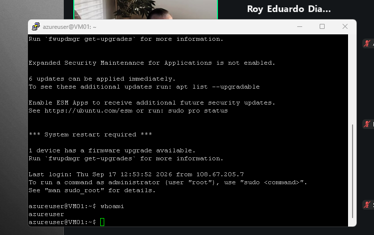

# CIT 386 Module 2 - Connection Runbook

**Student:** Roy Diaz  
**Course:** CIT 386  
**Server:** Azure Linux VM  
**Connection method:** SSH with PuTTY and public-key authentication

## 1. What is needed before starting

Install the current Windows version of **PuTTY** from the official PuTTY website. The installer includes both **PuTTY** and **PuTTYgen**.

Create a folder outside the public GitHub repository for the SSH key files. Example:

`C:\Users\<WindowsUser>\Documents\CIT386\keys\`

Keep these two key files in that private folder:

1. The instructor-provided SSH private key with the `.pem` extension.
2. The converted PuTTY private key named `cit386-server.ppk`, created in the next section.

Do **not** place either key file in the GitHub repository. The connection information used for this server is:

- Host/IP address: `48.211.168.52`
- SSH port: `22`
- User name: `azureuser`

## 2. Convert the PEM key to PuTTY PPK format

1. Open **PuTTYgen** from the Windows Start menu.
2. Click **Load**.
3. In the file picker, change the file type to **All Files (*.*)** if the `.pem` file is not visible.
4. Browse to `C:\Users\<WindowsUser>\Documents\CIT386\keys\`.
5. Select the instructor-provided `.pem` file and click **Open**.
6. After PuTTYgen reports that the key was imported successfully, click **OK**.
7. Click **Save private key**. Do not click **Save public key** for this step.
8. Save the converted key in the same private folder as:

`C:\Users\<WindowsUser>\Documents\CIT386\keys\cit386-server.ppk`

The `.pem` file is the input to PuTTYgen. The `.ppk` file is the converted private-key format that PuTTY uses for this connection.

**Security note:** Do not place a screenshot of the loaded key, key text, key fingerprint, `.pem` contents, or `.ppk` contents in the repository.

## 3. Configure PuTTY

### 3.1 Enter the server address and port

1. Open **PuTTY**.
2. Select **Session** in the left panel.
3. In **Host Name (or IP address)**, enter:

`48.211.168.52`

4. In **Port**, enter:

`22`

5. Make sure **SSH** is selected as the connection type.

### 3.2 Enter the user name

1. In the left panel, expand **Connection**.
2. Select **Data**.
3. In **Auto-login username**, enter:

`azureuser`

### 3.3 Select the PPK private key

1. In the left panel, expand **Connection**.
2. Expand **SSH**.
3. Select **Auth**, then **Credentials**.
4. Next to **Private key file for authentication**, click **Browse**.
5. Select:

`C:\Users\<WindowsUser>\Documents\CIT386\keys\cit386-server.ppk`

The file selected here must be the `.ppk` file, not the original `.pem` file.

### 3.4 Save the PuTTY session

1. Return to **Session** at the top of the left panel.
2. Under **Saved Sessions**, type:

`CIT386-Azure-Server`

3. Click **Save**.

The next time the server is needed, open PuTTY, click `CIT386-Azure-Server`, click **Load**, and then click **Open**.

## 4. Connect to the server

1. With the saved session loaded, click **Open**.
2. On the first connection, PuTTY displays a **PuTTY Security Alert** because the server host key has not been cached on this Windows computer before.
3. Confirm that the connection was started to the expected server at `48.211.168.52`. If it is the expected server, click **Accept** so PuTTY stores the host key for future connections.
4. Do not place the host-key fingerprint in the public repository or include it in a screenshot.
5. After authentication succeeds, a Linux shell prompt appears.

For this server, a successful prompt looks like:

```text
azureuser@VM01:~$
```

To verify the logged-in account, run:

```bash
whoami
```

Expected output:

```text
azureuser
```

### Screenshot - successful connection



The screenshot shows the Linux shell prompt and the `whoami` command returning `azureuser`. It does not contain the private key or a host-key fingerprint.

## 5. Troubleshooting

| Message | What it means | First thing to check |
|---|---|---|
| `Network error: Connection timed out` | PuTTY could not reach the SSH service before the connection attempt expired. | Check that **Host Name/IP** is `48.211.168.52` and **Port** is `22`. |
| `Network error: Connection refused` | The remote system responded, but nothing accepted the SSH connection on the selected port. | Check that PuTTY is using **port 22** and the **SSH** connection type. |
| `Server refused our key` | The server received the offered key but did not accept it for the account being used. | Check that **Auto-login username** is exactly `azureuser`; then confirm the correct `.ppk` file is selected. |
| `No supported authentication methods available (server sent: publickey)` | The server requires public-key authentication, but PuTTY did not provide an acceptable private key. | Go to **Connection > SSH > Auth > Credentials** and confirm that `cit386-server.ppk` is selected. |

If the settings above are correct and the connection still fails, verify that the VM is running and that SSH access has not been disabled or changed by the instructor.

## 6. Key handling

The original `.pem` file and the converted `.ppk` file are both **private-key files**. They are secret and must not be shared with another person, committed to GitHub, emailed publicly, or placed on an untrusted computer.

A **public key** file, usually ending in `.pub`, is the part of an SSH key pair that may be copied to another machine or installed on a server. The private `.pem` or `.ppk` file is the part that must remain private.

If either private-key file is exposed, assume the key is compromised. Stop using it, remove any public copy immediately, and contact the instructor or server administrator so the exposed key can be revoked and replaced with a new key pair.

## 7. Test the runbook

The connection itself was tested successfully: PuTTY reached the server, the shell prompt displayed `azureuser@VM01:~$`, and `whoami` returned `azureuser`.

For the final runbook test required by the assignment:

1. Close PuTTY.
2. Reopen PuTTY.
3. Select `CIT386-Azure-Server` under **Saved Sessions** and click **Delete**.
4. Close PuTTY again.
5. Follow this runbook from the top as if using a clean PuTTY configuration.
6. Recreate and save the session.
7. Connect to the server and run `whoami` again.
8. If any step required information that was not written here, add that missing information before submitting.

After completing that test, the runbook is ready to submit at:

`module02/connection-runbook.md`

## Repository safety checklist

Before committing, confirm that the repository does **not** contain:

- Any `.pem` file
- Any `.ppk` file
- Private-key text
- Public-key text copied from PuTTYgen
- A host-key fingerprint
- A screenshot showing key material

Only the written runbook and safe supporting screenshots should be committed.
